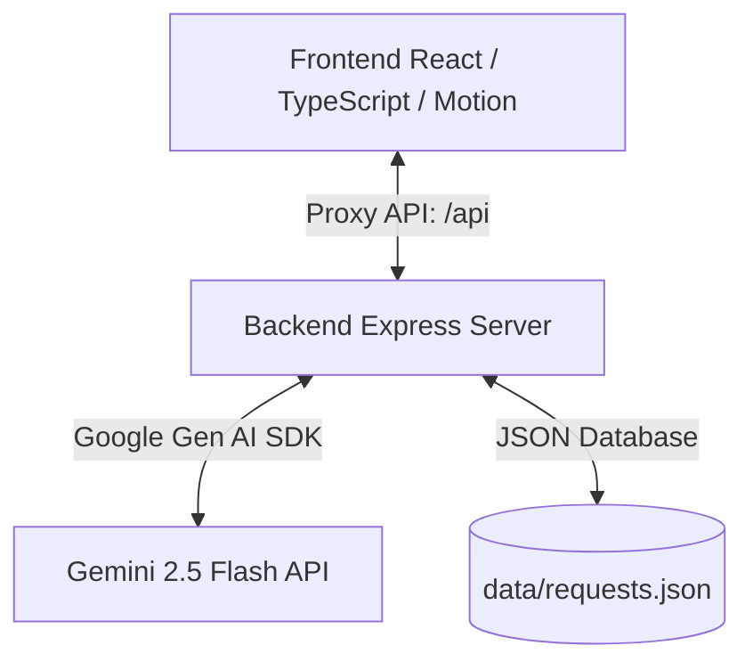

[](https://react.dev)
[](https://ai.google.dev)
[](LICENSE)

JanVikas AI is a premium, AI-driven civic priority evaluation platform designed for Members of Parliament (MPs) and local constituency administrators. It automates, aggregates, and prioritizes citizen-submitted infrastructure demands (roads, health, school, sanitation) using real-time generative AI analysis.

---

## 📸 Platform Banner

<div align="center">
  
</div>

---

## ✨ Core Features

### 1. ⚡ Real-Time AI Prioritization & Assessment
As a citizen describes a civic issue, the platform uses a debounced AI analysis check to analyze the description and predict:
* **Sentiment**: Detects safety risks, health hazards, and emergencies (categorized as *Critical*, *Neutral*, or *Positive*).
* **AI Priority Score**: A composite metric (0–100) based on urgency, danger, and safety impact.
* **Estimated Cost & Impact**: Outlines a realistic budget (in Lakhs of Rupees) and the number of citizens who will directly benefit.
* **Primary Need**: Clear engineering/infrastructure requirements summarized by the AI.

### 2. 📋 MP Recommendations Dashboard
Aggregates active citizen-submitted complaints and uses Gemini to group related demands into high-impact constituency-level project proposals, complete with estimated costs, timeline, and suggestions under the **MPLADS** (Member of Parliament Local Area Development Scheme) rules.

### 3. ⚖️ Multi-Criteria Side-by-Side Proposal Comparison
Enables administrators to pick two proposals and generate a detailed trade-off matrix. It evaluates demand levels, cost, timelines, user impact, safety risks, and provides a final recommended project choice with deep justification.

---

## 🛠️ Tech Stack & Architecture



* **Frontend**: React 19, TypeScript, Vite, Tailwind CSS, Lucide icons, Motion (animations).
* **Backend**: Node.js, Express, TypeScript (run via `tsx` / built via `esbuild`).
* **AI Model**: `gemini-2.5-flash` via the official `@google/genai` SDK.
* **Storage**: Local JSON database (`data/requests.json`).

---

## 🚀 Getting Started

### Prerequisites
* **Node.js** (v18 or higher recommended)
* **npm** (v9 or higher)

### 1. Installation
Clone the repository and install all dependencies:
```bash
npm install
```

### 2. Environment Configuration
Create a `.env` file in the root directory (or use `.env.local`):
```env
# GEMINI_API_KEY: Required for Gemini AI API calls.
GEMINI_API_KEY="your_gemini_api_key_here"

# APP_URL: The URL where the application is hosted
APP_URL="http://localhost:3000"
```

### 3. Running the Application

You can run the frontend and backend concurrently:

#### Option A: Running Development Servers (Recommended)
1. **Start Backend API Server** (runs on port `5001`):
   ```bash
   npm run dev:server
   ```
2. **Start Frontend Dev Server** (runs on port `3000` with API proxying):
   ```bash
   npm run dev
   ```

#### Option B: Build and Run Production
This builds the frontend bundle, compiles the backend into a single `server.cjs` file, and starts the server on port `5001`:
```bash
# Clean previous builds, compile frontend, and bundle Express
npm run build

# Start the unified production server
npm run start
```

---

## 📡 API Reference

The Express backend exposes the following endpoints for data management and AI evaluation:

| Method | Endpoint | Description |
| :--- | :--- | :--- |
| `GET` | `/api/requests` | Fetches all citizen requests from the database. |
| `POST` | `/api/requests` | Submits a new request and runs real-time Gemini prioritization. |
| `POST` | `/api/upvote` | Increments upvotes for a request and dynamically recalculates priority score. |
| `POST` | `/api/status` | Updates the workflow state (`Submitted` ➔ `Reviewed` ➔ `Approved` ➔ `In Progress` ➔ `Resolved`). |
| `POST` | `/api/prioritize` | Evaluates a single draft request's text on the fly without saving. |
| `GET` | `/api/recommendations` | Compiles active requests and groups them into MPLADS proposals. |
| `POST` | `/api/compare` | Runs a side-by-side structured comparison of two requests. |

---

## 📂 Project Structure

```text
├── data/
│   └── requests.json         # Local database store for citizen requests
├── src/
│   ├── components/
│   │   ├── AIRecommendations.tsx   # MP Dashboard & MPLADS Project recommendations
│   │   ├── ProposalComparison.tsx  # Side-by-side project comparison logic
│   │   ├── RequestForm.tsx         # Request submission form with real-time NLP preview
│   │   └── ...
│   ├── App.tsx               # Main application container
│   ├── main.tsx              # React entry point
│   ├── index.css             # Main styling index
│   └── mockData.ts           # Seeding data for first launch
├── server.ts                 # Express Backend Server (Typescript source)
├── package.json              # Script runners and dependencies
├── vite.config.ts            # Vite build, HMR, and backend proxy setup
└── tsconfig.json             # TypeScript compiler settings
```

---

## 🎨 Design & Accessibility
The UI follows a modern, elegant **Satyamev Jayate** / Indian government-themed aesthetic, utilizing premium colors:
* **Deep Navy (`#0b2240`)**: Promotes authority and structure.
* **Warm Saffron / Gold (`#d4af37`)**: Adds a premium civic touch.
* **Glassmorphism panels**: Ensures a modern, clean web layout.
* **Responsive Layouts**: Designed to be fully usable on both administrative desktops and citizens' mobile devices.
